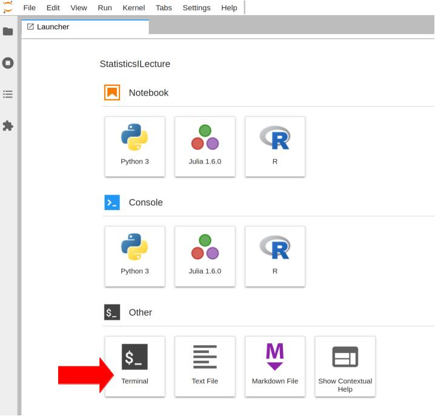
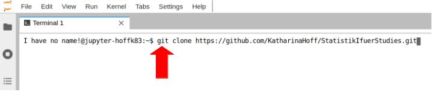
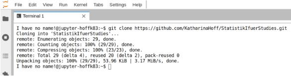
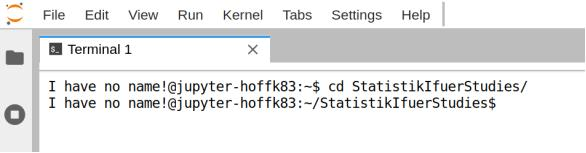
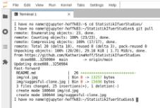

# JupyterNotebooks zur Lehrveranstaltung Statistik I (Universität Greifswald, Hoff)

Bitte beachten Sie die untenstehende Anleitung (bestehend aus "Erstmaliger Download des Materials" und "Update von Material").

## Erstmaliger Download des Materials

Bitte öffnen Sie im "Datascience+TF" Notebook des AppHubs der Universität Greifswald ein Terminal-Fenster (bitte anclicken zum Öffnen):



Geben Sie im Terminal folgendes Kommando ein (mit Enter-Taste bestätigen nach dem Eintippen):

```
git clone https://github.com/KatharinaHoff/StatistikIfuerStudies.git
```
Hier der Vorgang als Bild:



Als Ergebnis sollten Sie etwas sehen, dass so ähnlich wie folgendes Bild aussieht (kann durchaus leicht veränderte Werte anzeigen):



Das war's. Sie haben erfolgreich das aktuelle Material zu Statistik I erstmalig in Ihren AppHub geladen. Links im Dateibrowser wird mit ein paar Sekunden Zeitverzögerung ein neuer Ordner "StatistikIfuerStudies" auftauchen, in dem Sie die JupyterNotebooks finden.

## Update von Material

Im Laufe des Semesters werden die JupyterNotebooks synchron zu Moodle ergänzt. Um nach dem initialen, einmaligen Download des Repositories (s.o.) den eigenen lokalen Ordner auf den jeweils neuesten Stand zu bringen (dies fügt dann automatisch sofern vorhanden neue Notebooks Ihrem Ordner hinzu), müssen Sie zunächst mit dem Befehl:

```
cd StatistikIfuerStudies
```
in den Ordner StatistikIfuerStudies wechseln (wieder im Terminal, s.o.). Bildlich sieht das so aus (bitte Enter Drücken am Ende nicht vergessen):



Anschließend geben Sie das Kommando

```
git pull
```
ein. Das sieht dann so aus (Enter drücken wieder nicht vergessen):



Je nachdem, ob überhaupt ein Update verfügbar ist, kann die Ausgabe auch kürzer/kleiner ausfallen. Aber hiermit haben Sie dann Ihren Ordner erfolgreich synchronisiert.

### In diesem Repository werden grundsätzlich keine Musterlösungen zur Verfügung gestellt.

